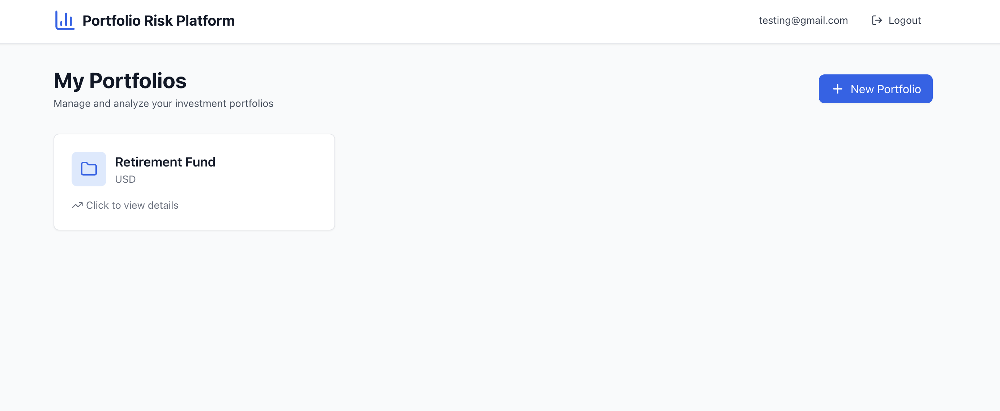
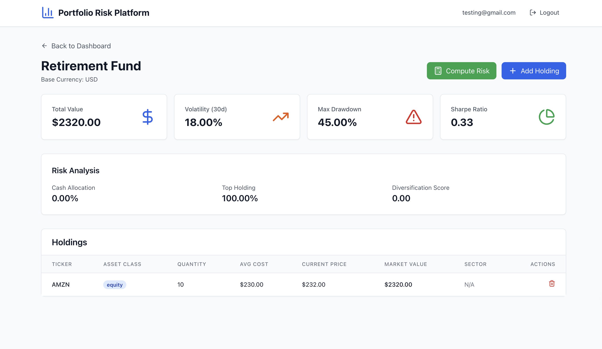

# 🏎️ Portfolio Risk & Recommendation Platform

A full-stack microservices platform for real-time portfolio analytics with **sub-50ms risk computation** using a Rust engine.

**[GitHub](https://github.com/yourusername/portfolio-risk-platform)**

---

## 🎯 What It Does

Manages investment portfolios, computes risk metrics (volatility, Sharpe ratio, drawdown), and displays interactive insights through a React dashboard. Built with a microservices architecture where Rust handles compute-heavy operations.

---

## ⚡ Why Rust?

I initially built this entirely in Python, but profiling revealed risk calculations were bottlenecking at **~500ms per portfolio**.

**The problem:** As portfolio complexity increased, performance degraded linearly. Unacceptable for real-time analytics.

**The solution:** Rewrote the compute layer in Rust with Actix-web, achieving:

- ✅ **<50ms latency** per portfolio (10x improvement)
- ✅ **Memory safety** without garbage collection overhead
- ✅ **Safe concurrency** for parallel portfolio processing
- ✅ **Predictable performance** under load

The risk engine runs as an isolated microservice, keeping the architecture clean and horizontally scalable.

---

## 📊 Performance Benchmarks

| Workload | Python Baseline | Rust Engine | Improvement |
|----------|----------------|-------------|-------------|
| 1 portfolio | ~500ms | **<50ms** | **10x faster** |
| 10 portfolios | ~5s | **<200ms** | **25x faster** |

*Rust provides order-of-magnitude improvements for compute-intensive financial calculations.*

---

## 🖥️ Screenshots

### Dashboard Overview


### Real-Time Risk Metrics


---

## 🏗️ Architecture
```
┌─────────────────┐         ┌──────────────────┐         ┌─────────────────┐
│   React + TS    │────────▶│   FastAPI        │────────▶│   Rust          │
│   Frontend      │  HTTP   │   Backend        │  HTTP   │   Risk Engine   │
│   (Port 80)     │         │   (Port 8000)    │         │   (Port 8001)   │
└─────────────────┘         └──────────────────┘         └─────────────────┘
                                      │
                                      │ SQLAlchemy ORM
                                      ▼
                            ┌──────────────────┐
                            │   PostgreSQL     │
                            │   Database       │
                            │   (Port 5432)    │
                            └──────────────────┘
```

**Service Communication:**
- Frontend → Backend: REST API with JWT auth
- Backend → Risk Engine: HTTP POST with JSON payload
- Backend → Database: SQLAlchemy ORM

---

## 🛠️ Tech Stack

**Frontend:** React 18, TypeScript, TailwindCSS, React Query, Vite  
**API Backend:** FastAPI, Pydantic, JWT, SQLAlchemy, PostgreSQL  
**Risk Engine:** Rust, Actix-web, Serde  
**DevOps:** Docker, Docker Compose, multi-stage builds

---

## 🚀 Quick Start
```bash
# Clone and start (requires Docker)
git clone https://github.com/yourusername/portfolio-risk-platform.git
cd portfolio-risk-platform
docker compose up

# Access the application
open http://localhost
```

**That's it.** All services start automatically with health checks and dependencies.

**Available at:**
- Frontend: http://localhost
- Backend API: http://localhost:8000
- API Docs: http://localhost:8000/docs
- Risk Engine: http://localhost:8001

---

## 🎯 Key Features

✅ **Portfolio Management** - Create/manage multiple portfolios with diverse asset classes  
✅ **Real-Time Risk Metrics** - Volatility, Sharpe ratio, max drawdown, diversification score  
✅ **JWT Authentication** - Secure user accounts with bcrypt password hashing  
✅ **Responsive UI** - Mobile-first design with TailwindCSS  
✅ **Production Ready** - Fully containerized with Docker Compose  

---

## 📡 API Endpoints

### Authentication
- `POST /auth/register` - Create account
- `POST /auth/login` - Get JWT token
- `GET /auth/me` - Current user info

### Portfolio Management
- `GET /portfolios` - List portfolios
- `POST /portfolios` - Create portfolio
- `GET /portfolios/{id}` - Portfolio details
- `DELETE /portfolios/{id}` - Delete portfolio

### Holdings
- `GET /portfolios/{id}/holdings` - List holdings
- `POST /portfolios/{id}/holdings` - Add holding
- `PUT /portfolios/{id}/holdings/{holding_id}` - Update holding
- `DELETE /portfolios/{id}/holdings/{holding_id}` - Remove holding

### Risk Analysis
- `POST /portfolios/{id}/risk/compute` - Calculate risk (calls Rust engine)
- `GET /portfolios/{id}/risk/latest` - Latest risk snapshot
- `GET /portfolios/{id}/risk/history` - Historical risk data

**Full interactive docs:** http://localhost:8000/docs

---

## 🗄️ Database Schema
```
users (id, email, password_hash, created_at)
  ↓
portfolios (id, user_id, name, base_currency, created_at)
  ↓
holdings (id, portfolio_id, ticker, asset_class, quantity, avg_cost, ...)
  ↓
risk_snapshots (id, portfolio_id, as_of, volatility, sharpe_ratio, ...)
```

*Normalized to 3NF with foreign key constraints and indexed lookups.*

---

## 🧪 Local Development

<details>
<summary>Click to expand local dev setup</summary>

### Backend
```bash
cd backend
python3 -m venv .venv
source .venv/bin/activate
pip install -e ".[dev]"
createdb portfolio_risk_dev
uvicorn app.main:app --reload
```

### Risk Engine
```bash
cd risk-engine
cargo run --release
```

### Frontend
```bash
cd frontend
npm install
npm run dev
```

</details>

---

## 🛣️ Roadmap

- [ ] Real-time market data integration (Alpha Vantage API)
- [ ] Redis caching layer for performance
- [ ] GitHub Actions CI/CD pipeline
- [ ] AWS ECS deployment
- [ ] ML-based drawdown prediction
- [ ] Portfolio rebalancing recommendations

---

## 👤 Author

**Your Name**  
[GitHub](https://github.com/glenn-kule) • [LinkedIn](https://linkedin.com/in/glenn-kule) • [Email](mailto:glennkule@gmail.com)

---

**Built with Python, Rust, React, PostgreSQL, and Docker**